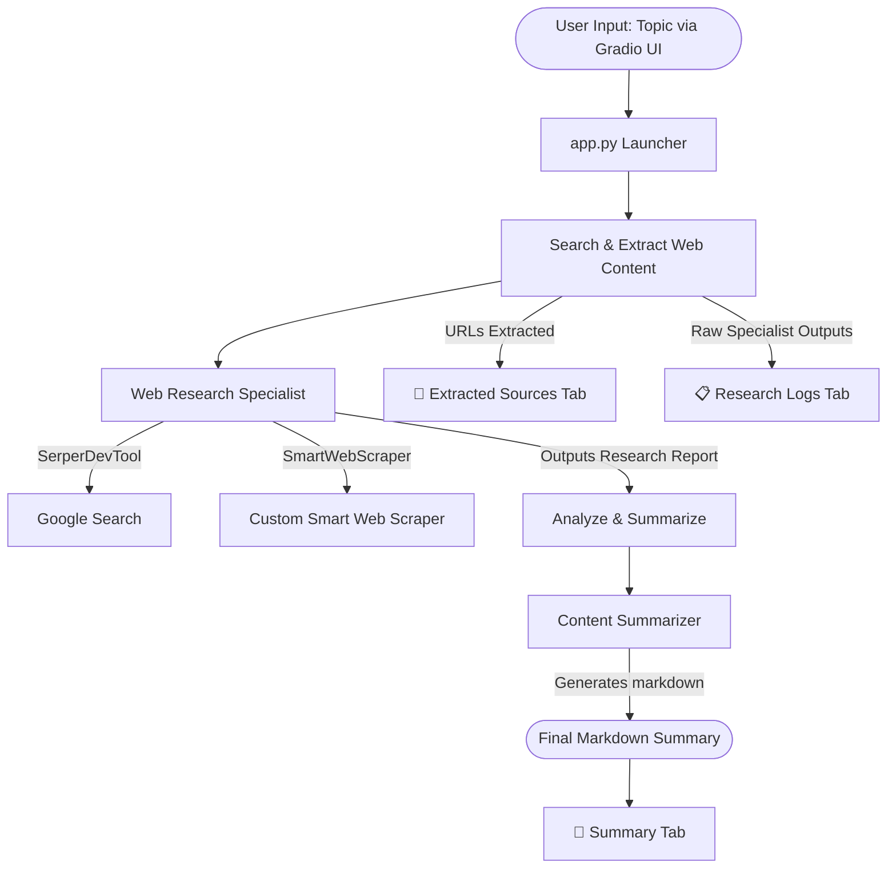

# Web Summarizer Agent Crew 🌐📝

An AI agent crew powered by [CrewAI](https://crewai.com) utilizing a JSON-first configuration and featuring an interactive **Gradio Web UI**. This project automates the workflow of searching the web for any specific topic, scraping the relevant content, extracting source URLs, and producing a structured Markdown summary.

---

## How It Works

The crew uses a **sequential process** where tasks are executed in order. Here is the workflow:



---

## Crew Architecture

### 1. Agents
The agents are configured in the `agents/` directory:
* **Web Research Specialist** (`agents/web_research_specialist.jsonc`):
  * **Role**: Expert AI researcher skilled in finding accurate sources.
  * **Goal**: Search the internet and scrape ONLY the top 2 relevant pages to gather high-density facts.
  * **Tools**: `SerperDevTool` (Google search queries), `custom:smart_web_scraper` (custom cleaned webpage & PDF text extractor).
  * **Optimizations**: Restricted to a maximum of 3 reasoning iterations (`max_iter: 3`) and guided to search once and scrape at most 2 URLs to avoid prompt overhead.
* **Content Summarizer** (`agents/content_summarizer.jsonc`):
  * **Role**: Technical writer and summarization specialist.
  * **Goal**: Synthesize lengthy research logs into clear, organized, objective summaries.
  * **Tools**: None (uses LLM reasoning).

### 2. Tasks
The tasks are configured in `crew.jsonc`:
* **Search the Web** (`search_the_web_for_task`):
  * **Description**: Queries search engines for `{topic}`, scrapes contents of matching pages, and outputs a research log.
  * **Agent**: Web Research Specialist
* **Analyze & Summarize** (`analyze_the_research_collected_task`):
  * **Description**: Processes research findings and builds a readable markdown summary containing titles, key bullet points, and a conclusion.
  * **Agent**: Content Summarizer

---

## Token Optimization & Custom Scraper Features 🚀

To prevent token bloating (reducing input tokens by **85%+**), this crew implements:
1. **Custom Smart Web Scraper (`tools/smart_web_scraper.py`)**:
   - **Boilerplate Removal**: Automatically strips `nav`, `footer`, `header`, `aside`, ads, and layout classes.
   - **Top-N Relevance Filtering**: Scores text paragraphs against the topic using keyword tf-idf density, returning only the top 6 highest-scoring blocks.
   - **Hard Truncation**: Enforces a strict limit of 4,500 characters per webpage (~1,000 tokens).
   - **PDF Parsing**: Automatically detects PDF links and extracts text via PyMuPDF/pdfplumber.
2. **Reasoning Loop Limits**: The researcher agent has a hard limit of `max_iter: 3` (down from 5) to prevent quadratic prompt growth during loop steps.
3. **Disabled Memory**: Turned off CrewAI's `memory` setting to prevent vector db searches from appending prompt-bloating historical summaries.

---

## Setup & Installation

### Prerequisites
* **Python**: `3.10` to `3.13`
* **Package Manager**: [uv](https://github.com/astral-sh/uv) (recommended, handled automatically by the CrewAI CLI)

### 1. Clone the Repository
```bash
git clone <your-github-repo-url>
cd <your-repo-name>
```

### 2. Set Up Environment Variables
Create a local `.env` file by copying the template:
```bash
cp .env.example .env
```
Open `.env` and fill in your API credentials:
```env
# The LLM model to use (default)
MODEL=openai/gpt-4.1-mini

# Your OpenAI API key for LLM operations
OPENAI_API_KEY=sk-proj-...

# Your Serper API key for Google searches
SERPER_API_KEY=your_serper_dev_key_here
```

### 3. Install Dependencies
Install the required packages and set up the local virtual environment:
```bash
crewai install
```

---

## Running the Agent

To kick off the crew, run:
```bash
crewai run
```
You will be prompted to enter a **topic** (e.g. `Quantum Computing progress in 2026`). The crew will start, execute the search, summarize the findings, and print the output.

### Running with Gradio Web UI 🌐

You can also run the crew using a beautiful browser-based UI. To launch the web interface:

```bash
uv run python app.py
```

Then, open `http://127.0.0.1:7860` in your web browser. You can:
1. Enter your research topic.
2. Click **Launch Agents**.
3. View the final **Summary** (rendered in Markdown), the list of **Extracted Sources** (as clickable links), and the detailed **Research Logs** in a clean, interactive dashboard.

---

## Project Structure

```text
├── agents/
│   ├── content_summarizer.jsonc       # Configuration for the Summarizer agent
│   └── web_research_specialist.jsonc  # Configuration for the Search agent
├── tools/                             # Custom python tools directory (if any)
├── knowledge/                         # Local text files for agents custom knowledge base
├── .env.example                       # Template for secrets and credentials
├── .gitignore                         # Config files to prevent leaking keys/venv
├── crew.jsonc                         # Main configuration linking agents & tasks
├── pyproject.toml                     # Python dependencies & crew definition
└── README.md                          # Project documentation (this file)
```

> **Security Warning:** The `custom:<name>` tool references can run local python code inside the `tools/` folder. Only execute crews from sources you trust.
