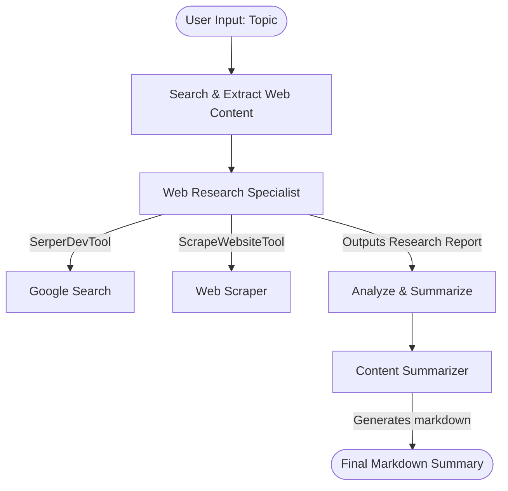

# Web Summarizer Agent Crew 🌐📝

An AI agent crew powered by [CrewAI](https://crewai.com) utilizing a JSON-first configuration. This project automates the workflow of searching the web for any specific topic, scraping the relevant content, and producing a structured markdown summary.

---

## How It Works

The crew uses a **sequential process** where tasks are executed in order. Here is the workflow:



---

## Crew Architecture

### 1. Agents
The agents are configured in the `agents/` directory:
* **Web Research Specialist** (`agents/web_research_specialist.jsonc`):
  * **Role**: Expert AI researcher skilled in finding accurate sources.
  * **Goal**: Search the internet, extract relevant content, and organize findings.
  * **Tools**: `SerperDevTool` (Google search queries), `ScrapeWebsiteTool` (scrapes webpage content).
* **Content Summarizer** (`agents/content_summarizer.jsonc`):
  * **Role**: Technical writer and summarization specialist.
  * **Goal**: Synthesize lengthy research logs into clear, organized, objective summaries.

### 2. Tasks
The tasks are configured in `crew.jsonc`:
* **Search the Web** (`search_the_web_for_task`):
  * **Description**: Queries search engines for `{topic}`, scrapes contents of matching pages, and outputs a research log.
  * **Agent**: Web Research Specialist
* **Analyze & Summarize** (`analyze_the_research_collected_task`):
  * **Description**: Processes research findings and builds a readable markdown summary containing titles, key bullet points, and a conclusion.
  * **Agent**: Content Summarizer

---

## Setup & Installation

### Prerequisites
* **Python**: `3.10` to `3.13`
* **Package Manager**: [uv](https://github.com/astral-sh/uv) (recommended, handled automatically by the CrewAI CLI)

### 1. Clone the Repository
```bash
git clone <your-github-repo-url>
cd <your-repo-name>
```

### 2. Set Up Environment Variables
Create a local `.env` file by copying the template:
```bash
cp .env.example .env
```
Open `.env` and fill in your API credentials:
```env
# The LLM model to use (default)
MODEL=openai/gpt-4.1-mini

# Your OpenAI API key for LLM operations
OPENAI_API_KEY=sk-proj-...

# Your Serper API key for Google searches
SERPER_API_KEY=your_serper_dev_key_here
```

### 3. Install Dependencies
Install the required packages and set up the local virtual environment:
```bash
crewai install
```

---

## Running the Agent

To kick off the crew, run:
```bash
crewai run
```
You will be prompted to enter a **topic** (e.g. `Quantum Computing progress in 2026`). The crew will start, execute the search, summarize the findings, and print the output.

---

## Project Structure

```text
├── agents/
│   ├── content_summarizer.jsonc       # Configuration for the Summarizer agent
│   └── web_research_specialist.jsonc  # Configuration for the Search agent
├── tools/                             # Custom python tools directory (if any)
├── knowledge/                         # Local text files for agents custom knowledge base
├── .env.example                       # Template for secrets and credentials
├── .gitignore                         # Config files to prevent leaking keys/venv
├── crew.jsonc                         # Main configuration linking agents & tasks
├── pyproject.toml                     # Python dependencies & crew definition
└── README.md                          # Project documentation (this file)
```

> **Security Warning:** The `custom:<name>` tool references can run local python code inside the `tools/` folder. Only execute crews from sources you trust.
